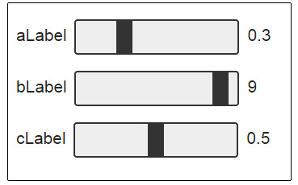
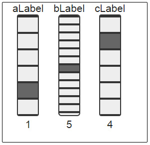
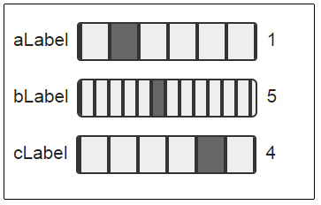
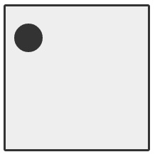
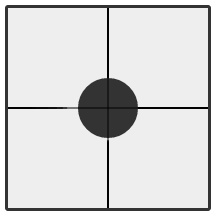
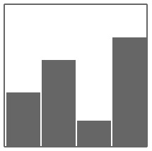
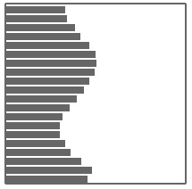
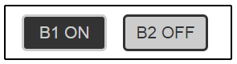

#TouchLibJS
UI toolkit for mouse and touch.
___
####Dependencies
HTML5 browser

___

#TouchLib Objects and Usage
###Vertical Slider (TouchLib.VertSlider)


Instantiation:
```javascript
var vertSlider = new TouchLib.VertSlider({
  //DOM element in which the slider will be created (required)
  elementId: 'vSliderDOMelement',
  //Text label for the slider (optional)
  label: 'Label',
  //Color of the active slider region, CSS formatted (optional)
  fillstyle: '#3366dd',
  //Width of the slider in pixels (optional)
  width: 40,
  //Height of the slider in pixels (optional)
  height: 200,
  //Initial value of the slider [0 - 1], (optional)
  initVal: 0.0,
  //Boolean value, a truthy value allows developer to map a 
  //different range to output text (optional)
  outputIsOverridden: false,
  //Slider CSS attributes (optional)
  sliderCss: {
    background: '#444477',
    border: '2px solid #0033cc',
    borderRadius: '4px',
  },
  //Notifiy funtion gets called when value changes (required)
  //parameter 'val' is a normalized value [0 - 1]
  notify: function (val) {
    console.log('vertSlider1 val:', val);
  }
});
```
VertSlider Methods:
```javascript
vertSlider.getVal(); //returns the normalized value [0 - 1]
vertSlider.setValue(Number); //accepts a normalized value [0 - 1]
vertSlider.setClass(String); //sets the css class of the slider elements
```
[Vertical Slider Usage example](demo/verticalSliderDemo.html)
___

###Horizontal Slider (TouchLib.HorizSlider)



Instantiation:
```javascript
var horizSlider = new TouchLib.HorizSlider({
  //DOM element in which the slider will be created (required)
  elementId: 'hSlider3',
  //Text label for the slider (optional)
  label: 'Label',
  //Color of the active slider region, CSS formatted (optional)
  fillstyle: '#3366dd',
  //Width of the slider in pixels (optional)
  width: 200,
  //Height of the slider in pixels (optional)
  height: 40,
  //Initial value of the slider [0 - 1], (optional)
  initVal: 1.0,
  //Boolean value, a truthy value allows developer to map a 
  //different range to output text (optional)
  outputIsOverridden: false,
  //CSS class name of slider elements (optional)
  cssClass: 'horizSliderClass',
  //Slider CSS attributes (optional)
  sliderCss: {
    background: '#444477',
    border: '2px solid #0033cc',
    borderRadius: '4px',
  },
  //Notifiy funtion gets called when value changes (required)
  //parameter 'val' is a normalized value [0 - 1]
  notify: function (val) {
    console.log('hSlider3 val:', val);
  }
});
```
HorizSlider Methods:
```javascript
horizSlider.getVal(); //returns the normalized value [0 - 1]
horizSlider.setValue(Number); //accepts a normalized value [0 - 1]
horizSlider.setClass(String); //sets the css class of the slider elements
```
[Horizontal Slider Usage Example](demo/horizontalSliderDemo.html)
___
###Discrete Vertical Slider (TouchLib.DiscreteVertSlider)



The constructor JSON parameter is very similar to TouchLib.VertSlider.  Therefore only unique parameters are commented here.
Instantiation:
```javascript
var dvSlider = new TouchLib.DiscreteVertSlider({
  elementId: 'parentElementID',
  label: 'Label',
  fillstyle: '#3366dd',
  width: 40,
  height: 200,
  //CSS formated color for the lines between bins
  binBorderColor: '#2222cc',
  //the number of bins the discrete slider will have
  numBins: 6,
  //note outputIsOverriden has a truthy value,
  //and is directly related to the innerHTML
  //statement in the notification function
  outputIsOverridden: true,
  initVal: 0,
  sliderCss: {
    background: '#444477',
    border: '2px solid #0033cc',
    borderRadius: '4px',
  },
  //returns the bin index
  //gets called when the bin index changes
  notify: function (val) {
    this.outputEl.innerHTML = val;
    console.log('dvSlider1 val: ', val);
  }
});
```
DiscreteVertSlider Methods:
```javascript
dvSlider.getVal() //return the active bin index
dvSlider.setBin(Number) //set the active bin index
dvSlider.setClass(String); //sets the css class of the slider elements
```
[Discrete Vertical Slider Usage Example](demo/discreteVerticalSliderDemo.html)
___

###Discrete Horizontal Slider (TouchLib.DiscreteHorizSlider)



The constructor JSON parameter is very similar to TouchLib.VertSlider.  Therefore only unique parameters are commented here.
Instantiation:
```javascript
var dhSlider = new TouchLib.DiscreteHorizSlider({
  elementId: 'parentElementID',
  label: 'Label',
  fillstyle: '#3366dd',
  width: 200,
  height: 40,
  //CSS formated color for the lines between bins
  binBorderColor: '#2222cc',
  //the number of bins the discrete slider will have
  numBins: 6,
  outputIsOverridden: true,
  initVal: 0,
  cssClass: 'horizSliderClass',
  sliderCss: {
    background: '#444477',
    border: '2px solid #0033cc',
    borderRadius: '4px',
  },
  //returns the bin index
  //gets called when the bin index changes
  notify: function (val) {
    this.outputEl.innerHTML = val;
    console.log('hvSlider1 val: ', val);
  }
});
```
DiscreteHorizSlider Methods:
```javascript
dhSlider.getVal() //return the active bin index
dhSlider.setBin(Number) //set the active bin index
dhSlider.setClass(String); //sets the css class of the slider elements
```
[Discrete Horizontal Slider Usage Example](demo/discreteHorizontalSliderDemo.html)
___

###Slider2D (TouchLib.Slider2D)



Instantiation:
```javascript
var slider2d = new TouchLib.Slider2D({
  elementId: 'parentElementID',
  width: 200,
  height: 200,
  cssClass: 'slider2D',
  //CSS formated color of the location circle
  fillStyle: '#4444aa',
  //radius of the location circle
  radius: 20,
  //notify function is called when values change
  //returns a JSON object of normalized values {x: [0 - 1], y: [0 - 1]}
  notify: function (vals) {
    console.log('x: ' + vals.x + ', y: ' + vals.y);
  } 
});
```
Slider2D Methods:
```javascript
slider2d.getNormalVal() //returns JSON object of normalized values [0 - 1]
slider2d.setNormalPosition(Number x, Number y) //takes normalized values [0 - 1]
slider2d.setClass(String); //sets the css class of the slider elements
```
[Slider2D Usage Example](demo/slider2dDemo.html)
___

###Joystick (TouchLib.Joystick)



Constructor JSON parameters are identical to Slider2D. Instantiation:
```javascript
var joystick = new TouchLib.Joystick({
  elementId: 'parentElementID',
  width: 200,
  height: 200,
  radius: 30,
  fillStyle: '#333366',
  cssClass: 'joystick',
  notify: function (vals) {
    console.log('x: ' + vals.x + ', y: ' + vals.y);
  } 
});
```
Joystick Methods:
```javascript
joystick.setClass(String); //sets the css class of the slider elements
```
[Joystick Usage Example](demo/joystickDemo.html)
___

###Knob (TouchLib.Knob)


Instantiation:
```javascript
var knob = new TouchLib.Knob({
  elementId: 'knobElement',
  width: 150,
  height: 150,
  cssClass: 'knob',
  //CSS formatted color of the inactive part of the knob
  outline: '#ccccff',
  //CSS formatted color of the active part of the knob
  fillStyle: '#333366',
  //Notification funciton is called when the value changes
  //Returns a normalized value [0 - 1]
  notify: function (val) {
    console.log('knob: ' + val);
  }
});
```
Knob Methods:
```javascript
knob.getVal(); //returns the normalized value [0 - 1]
knob.setVal(Number); //takes a normalized value [0 - 1]
knob.setClass(String); //sets the css class of the slider elements
```
[Knob Usage Example](demo/knobDemo.html)
___

###Vertical Slider Field (TouchLib.SliderFieldVert)



Instantiation:
```javascript
var vsField = new TouchLib.SliderFieldVert({
  elementId: 'parentElementID',
  width: 200,
  height: 200,
  //Number of sliders in the slider field
  numSliders: 4,
  cssClass: 'sliderField',
  //Notification funciton is called when a slider value changes
  //Returns an array of normalized values [0 - 1]
  notify: function (valArr) {
    console.log(valArr);
  }
});
```
Vertical Slider Field Methods:
```javascript
vsField.getVal(); //return an array of normalized values [0 - 1]
vsField.setVal(Number index, Number val); //sets a specific slider
vsField.setVals(Array vals); //takes an array of normalized values [0 - 1]
vsField.setClass(String); //sets the css class of the slider elements
```
[Vertical Slider Field Usage Example](demo/sliderFieldDemo.html)
___

###Horizontal Slider Field  (TouchLib.SliderFieldHoriz)



Instantiation:
```javascript
var hsField  = new TouchLib.SliderFieldHoriz({
  elementId: 'slidersH',
  width: 200,
  height: 200,
  //Number of sliders in the slider field
  numSliders: 20,
  cssClass: 'sliderField',
  //Notification funciton is called when a slider value changes
  //Returns an array of normalized values [0 - 1]
  notify: function (valArr) {
    console.log(valArr);
  }
});
```
Horizontal Slider Field Methods:
```javascript
hsField.getVal(); //return an array of normalized values [0 - 1]
hsField.setVal(Number index, Number val); //sets a specific slider
hsField.setVals(Array vals); //takes an array of normalized values [0 - 1]
hsField.setClass(String); //sets the css class of the slider elements
```
[Horizontal Slider Field Usage Example](demo/sliderFieldDemo.html)
___

###Toggle Button (TouchLib.ToggleButton)



Instantiation:
```javascript
var toggleButton = new TouchLib.ToggleButton({
  elementId: 'parentElementID',
  //On state CSS properties
  on: {
    innerHTML: 'B1 ON',
    border: '3px solid #2222cc',
    background: '#666699',
    color: '#222222'
  },
  //Off state CSS properties
  off: {
    innerHTML: 'B1 OFF',
    border: '3px solid #cc2222',
    background: '#996666',
    color: '#222222'
  },
  //Other CSS properties
  cssClassName: 'button',
  //Notification function is called on state change
  //Returns a boolean value representing the state of the button
  notify: function (val) {
    console.log('button val: ', val);
  }
});
```
Toggle Button Methods:
```javascript
toggleButton.setVal(Boolean); //Set the state of the button to a boolean value
toggleButton.getVal(); //Returns the current boolean state of the button
toggleButton.setClass(String); //sets the css class of the slider elements
```
[Toggle Button Usage Example](demo/toggleButtonDemo.html)
___

###Trigger Button (TouchLib.TriggerButton)

Instantiation:
```javascript
var triggerButton = new TouchLib.TriggerButton({
  elementId: 'parentElementID',
  //Number of milliseconds for trigger view to stay in triggered state
  triggerTimeout: 150,
  //On state CSS properties
  on: {
    innerHTML: 'B1 ON',
    border: '3px solid #2222cc',
    background: '#666699',
    color: '#222222'
  },
  //Off state CSS properties
  off: {
    innerHTML: 'B1 OFF',
    border: '3px solid #cc2222',
    background: '#996666',
    color: '#222222'
  },
  //Other CSS properties
  cssClassName: 'button',
  //Notification function is called when button is triggered
  notify: function () {
    console.log('button triggered');
  }
});
```
Trigger Button Methods:
```javascript
triggerButton.processAction(); //triggers the button
triggerButton.setClass(String); //sets the css class of the slider elements
```
[Trigger Button Usage Example](demo/triggerButtonDemo.html)
___

