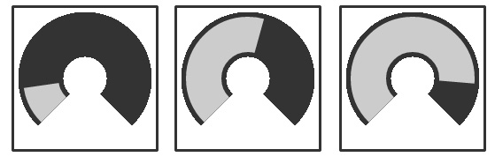

#TouchLibJS
UI toolkit for mouse and touch.

####Dependencies
HTML5 browser

#Tools and Usage

###Vertical Slider

[Useage example](demo/verticalSliderDemo.html)

###Horizontal Slider

[Useage example](demo/horizontalSliderDemo.html)

###Discrete Vertical Slider

[Useage example](demo/discreteVerticalSliderDemo.html)

###Discrete Horizontal Slider

[Useage example](demo/discreteHorizontalSliderDemo.html)

###Slider2D

[Useage example](demo/slider2dDemo.html)

###Joystick

[Useage example](demo/joystickDemo.html)

###Knob

[Useage example](demo/knobDemo.html)

###Vertical Slider Field

[Useage example](demo/sliderFieldDemo.html)

###Horizontal Slider Field

[Useage example](demo/sliderFieldDemo.html)

###Toggle Button

[Useage example](demo/toggleButtonDemo.html)

###Trigger Button
[Useage example](demo/triggerButtonDemo.html)